# Cupid Workflow Diagram

> **Source of Truth**: `apps/cupid/backend/app/`
> **Generated**: 2024-12-06

---

## Agent Class Diagram

```mermaid
classDiagram
    direction TB

    class Introduction {
        <<Narrative Agent>>
        +name: "Introduction"
        +instructions: instructions/cupid-agent-introduction.md
        +model: gpt-5.1
        +reasoning: low
        +output_type: text
        +summary: null
        ---
        +streaming: true
        +display_response_in_chat: true
        +write_to_conversation_history: true
        ---
        +context: null
        +links_to: [DisplayMortal]
    }

    class Mortal {
        <<Narrative Agent>>
        +name: "Mortal"
        +instructions: instructions/cupid-agent-mortal.md
        +model: gpt-5.1
        +reasoning: low
        +output_type: text
        +summary: auto
        ---
        +streaming: true
        +display_response_in_chat: true
        +write_to_conversation_history: true
        ---
        +context: MortalContext
        +links_to: [DisplayMatch]
    }

    class Match {
        <<Narrative Agent>>
        +name: "Match"
        +instructions: instructions/cupid-agent-match.md
        +model: gpt-5.1
        +reasoning: low
        +output_type: text
        +summary: auto
        ---
        +streaming: true
        +display_response_in_chat: true
        +write_to_conversation_history: true
        ---
        +context: MatchContext
        +links_to: [ContinueCard]
    }

    class StartCupidGame {
        <<Narrative Agent>>
        +name: "StartCupidGame"
        +instructions: instructions/cupid-agent-start-cupid-game.md
        +model: gpt-5.1
        +reasoning: low
        +output_type: text
        +summary: null
        ---
        +streaming: true
        +display_response_in_chat: true
        +write_to_conversation_history: true
        ---
        +context: null
        +links_to: [DisplayChoices]
    }

    class CupidGame {
        <<Narrative Agent>>
        +name: "CupidGame"
        +instructions: instructions/cupid-agent-cupid-game.md
        +model: gpt-5.1
        +reasoning: low
        +output_type: text
        +summary: null
        ---
        +streaming: true
        +display_response_in_chat: true
        +write_to_conversation_history: true
        ---
        +context: null
        +links_to: [HasEnded]
    }

    class CompatibilityAnalysis {
        <<Narrative Agent>>
        +name: "CompatibilityAnalysis"
        +instructions: instructions/cupid-agent-compatibility-analysis.md
        +model: gpt-5.1
        +reasoning: low
        +output_type: text
        +summary: auto
        ---
        +streaming: true
        +display_response_in_chat: true
        +write_to_conversation_history: true
        ---
        +context: null
        +links_to: [ContinueCard]
    }

    class CupidEvaluation {
        <<Narrative Agent>>
        +name: "CupidEvaluation"
        +instructions: instructions/cupid-agent-cupid-evaluation.md
        +model: gpt-5.1
        +reasoning: low
        +output_type: text
        +summary: null
        ---
        +streaming: true
        +display_response_in_chat: true
        +write_to_conversation_history: true
        ---
        +context: null
        +links_to: [END]
    }

    class DisplayMortal {
        <<Display Agent>>
        +name: "DisplayMortal"
        +instructions: dynamic
        +model: gpt-5.1
        +reasoning: none
        +output_type: ProfileCardOutput
        +summary: null
        ---
        +streaming: false
        +display_response_in_chat: false
        +write_to_conversation_history: false
        ---
        +context: DisplayMortalContext
        +links_to: []
    }

    class DisplayMatch {
        <<Display Agent>>
        +name: "DisplayMatch"
        +instructions: dynamic
        +model: gpt-5.1
        +reasoning: none
        +output_type: ProfileCardOutput
        +summary: null
        ---
        +streaming: false
        +display_response_in_chat: false
        +write_to_conversation_history: false
        ---
        +context: DisplayMatchContext
        +links_to: []
    }

    class DisplayCompatibilityCard {
        <<Display Agent>>
        +name: "DisplayCompatibilityCard"
        +instructions: instructions/cupid-agent-display-compatibility-card.md
        +model: gpt-5.1
        +reasoning: low
        +output_type: CompatibilityCardOutput
        +summary: auto
        ---
        +streaming: false
        +display_response_in_chat: false
        +write_to_conversation_history: false
        ---
        +context: DisplayCompatibilityCardContext
        +links_to: [CompatibilityAnalysis]
    }

    class DisplayChoices {
        <<Display Agent>>
        +name: "DisplayChoices"
        +instructions: dynamic
        +model: gpt-5.1
        +reasoning: low
        +output_type: ChoicesOutput
        +summary: auto
        ---
        +streaming: false
        +display_response_in_chat: false
        +write_to_conversation_history: false
        ---
        +context: DisplayChoicesContext
        +links_to: []
    }

    class GameDashboard {
        <<Display Agent>>
        +name: "GameDashboard"
        +instructions: instructions/cupid-agent-game-dashboard.md
        +model: gpt-5.1
        +reasoning: low
        +output_type: GameDashboardOutput
        +summary: auto
        ---
        +streaming: false
        +display_response_in_chat: false
        +write_to_conversation_history: false
        ---
        +context: GameDashboardContext
        +links_to: [CupidGame]
    }

    class DisplayEvaluationCard {
        <<Display Agent>>
        +name: "DisplayEvaluationCard"
        +instructions: dynamic
        +model: gpt-5.1
        +reasoning: low
        +output_type: EvaluationCardOutput
        +summary: auto
        ---
        +streaming: false
        +display_response_in_chat: false
        +write_to_conversation_history: false
        ---
        +context: conversation_history
        +links_to: []
    }

    class EvaluateSceneScore {
        <<Logic Agent>>
        +name: "EvaluateSceneScore"
        +instructions: instructions/cupid-agent-evaluate-scene-score.md
        +model: gpt-5.1
        +reasoning: none
        +output_type: SceneScoreOutput
        +summary: null
        ---
        +streaming: false
        +display_response_in_chat: false
        +write_to_conversation_history: true
        ---
        +context: null
        +links_to: [GameDashboard]
    }

    class HasEnded {
        <<Logic Agent>>
        +name: "HasEnded"
        +instructions: dynamic
        +model: gpt-5.1
        +reasoning: low
        +output_type: HasEndedOutput
        +summary: auto
        ---
        +streaming: false
        +display_response_in_chat: false
        +write_to_conversation_history: false
        ---
        +context: HasEndedContext
        +links_to: [DisplayEvaluationCard, DisplayChoices]
    }

    %% Context Classes
    class MortalContext {
        <<Context>>
        +state_mortal: str
    }

    class MatchContext {
        <<Context>>
        +state_match: str
    }

    class DisplayMortalContext {
        <<Context>>
        +state_mortal: str
    }

    class DisplayMatchContext {
        <<Context>>
        +state_match: str
    }

    class DisplayCompatibilityCardContext {
        <<Context>>
        +state_compatibility: str
    }

    class DisplayChoicesContext {
        <<Context>>
        +message_content: str
    }

    class GameDashboardContext {
        <<Context>>
        +state_compatibility: str
        +input_output_parsed_score: str
        +current_compatibility: int
        +scene_number: int
    }

    class HasEndedContext {
        <<Context>>
        +narrative_content: str
    }

    %% Relationships - Agent Flow
    Introduction --> DisplayMortal : chapter 0
    DisplayMortal ..> MortalContext : uses

    Mortal --> DisplayMatch : chapter 1
    Mortal ..> MortalContext : uses
    DisplayMatch ..> DisplayMatchContext : uses

    Match --> DisplayCompatibilityCard : chapter 2-3
    Match ..> MatchContext : uses

    DisplayCompatibilityCard --> CompatibilityAnalysis : chapter 3
    DisplayCompatibilityCard ..> DisplayCompatibilityCardContext : uses

    StartCupidGame --> DisplayChoices : chapter 4
    DisplayChoices ..> DisplayChoicesContext : uses

    EvaluateSceneScore --> GameDashboard : chapter 5
    GameDashboard --> CupidGame : chapter 5
    GameDashboard ..> GameDashboardContext : uses
    CupidGame --> HasEnded : chapter 5
    HasEnded ..> HasEndedContext : uses

    HasEnded --> DisplayEvaluationCard : has_ended=true
    HasEnded --> DisplayChoices : has_ended=false

    DisplayEvaluationCard --> CupidEvaluation : chapter 6
```



---

## Agent Properties Table

| Agent | Type | Model | Reasoning | Summary | Output | Streaming | Display | History | Context |
|-------|------|-------|-----------|---------|--------|-----------|---------|---------|---------|
| **Introduction** | Narrative | gpt-5.1 | low | - | text | true | true | true | - |
| **Mortal** | Narrative | gpt-5.1 | low | auto | text | true | true | true | MortalContext |
| **Match** | Narrative | gpt-5.1 | low | auto | text | true | true | true | MatchContext |
| **StartCupidGame** | Narrative | gpt-5.1 | low | - | text | true | true | true | - |
| **CupidGame** | Narrative | gpt-5.1 | low | - | text | true | true | true | - |
| **CompatibilityAnalysis** | Narrative | gpt-5.1 | low | auto | text | true | true | true | - |
| **CupidEvaluation** | Narrative | gpt-5.1 | low | - | text | true | true | true | - |
| **DisplayMortal** | Display | gpt-5.1 | none | - | ProfileCardOutput | false | false | false | DisplayMortalContext |
| **DisplayMatch** | Display | gpt-5.1 | none | - | ProfileCardOutput | false | false | false | DisplayMatchContext |
| **DisplayCompatibilityCard** | Display | gpt-5.1 | low | auto | CompatibilityCardOutput | false | false | false | DisplayCompatibilityCardContext |
| **DisplayChoices** | Display | gpt-5.1 | low | auto | ChoicesOutput | false | false | false | DisplayChoicesContext |
| **GameDashboard** | Display | gpt-5.1 | low | auto | GameDashboardOutput | false | false | false | GameDashboardContext |
| **DisplayEvaluationCard** | Display | gpt-5.1 | low | auto | EvaluationCardOutput | false | false | false | conversation_history |
| **EvaluateSceneScore** | Logic | gpt-5.1 | none | - | SceneScoreOutput | false | false | true | - |
| **HasEnded** | Logic | gpt-5.1 | low | auto | HasEndedOutput | false | false | false | HasEndedContext |

---

## Agent Instructions Reference

| Agent | Instructions Source |
|-------|-------------------|
| Introduction | `instructions/cupid-agent-introduction.md` |
| Mortal | `instructions/cupid-agent-mortal.md` + `{{state.mortal}}` |
| Match | `instructions/cupid-agent-match.md` + `{{state.match}}` |
| StartCupidGame | `instructions/cupid-agent-start-cupid-game.md` |
| CupidGame | `instructions/cupid-agent-cupid-game.md` |
| CompatibilityAnalysis | `instructions/cupid-agent-compatibility-analysis.md` |
| CupidEvaluation | `instructions/cupid-agent-cupid-evaluation.md` |
| DisplayMortal | Dynamic: "Generate ProfileCard from {{state.mortal}}" |
| DisplayMatch | Dynamic: "Generate ProfileCard from {{state.match}}" |
| DisplayCompatibilityCard | `instructions/cupid-agent-display-compatibility-card.md` + `{{state.compatibility}}` |
| DisplayChoices | Dynamic: "Extract choices from message content" |
| GameDashboard | `instructions/cupid-agent-game-dashboard.md` + multiple vars |
| DisplayEvaluationCard | Dynamic: "Generate transition message" |
| EvaluateSceneScore | `instructions/cupid-agent-evaluate-scene-score.md` |
| HasEnded | Dynamic: "Analyze narrative for end conditions" |

---

## Context Classes Detail

```yaml
MortalContext:
  state_mortal: str  # YAML string of mortal character data

MatchContext:
  state_match: str  # YAML string of match character data

DisplayMortalContext:
  state_mortal: str  # YAML string for ProfileCard generation

DisplayMatchContext:
  state_match: str  # YAML string for ProfileCard generation

DisplayCompatibilityCardContext:
  state_compatibility: str  # YAML string of compatibility data

DisplayChoicesContext:
  message_content: str  # Last narrative text to parse for options

GameDashboardContext:
  state_compatibility: str       # YAML baseline compatibility
  input_output_parsed_score: str # Score delta from EvaluateSceneScore
  current_compatibility: int     # Running total (0-100)
  scene_number: int              # Current scene count

HasEndedContext:
  narrative_content: str  # Last narrative text to analyze for ending
```

---

## Mermaid Flowchart

```mermaid
flowchart TD
    subgraph INIT["INITIALIZATION"]
        START([START]) --> LOAD_STATE{Load thread.metadata}
        LOAD_STATE --> |New thread| INIT_STATE[Initialize state:<br/>chapter=0<br/>current_compatibility=69<br/>scene_number=1]
        LOAD_STATE --> |Existing| ROUTE
        INIT_STATE --> ROUTE
    end

    subgraph STATE["STATE VARIABLES"]
        direction LR
        S_CH[chapter: int]
        S_COMP[current_compatibility: int]
        S_SCENE[scene_number: int]
        S_MORTAL[mortal_data: yaml]
        S_MATCH[match_data: yaml]
        S_COMPAT[compatibility_data: yaml]
    end

    ROUTE{Route by chapter}

    subgraph CH0["CHAPTER 0: Introduction"]
        CH0_INTRO[Introduction Agent<br/>streamed]
        CH0_DISPLAY[DisplayMortal Agent<br/>structured]
        CH0_WIDGET[/ProfileCard Widget/]
        CH0_INTRO --> CH0_DISPLAY
        CH0_DISPLAY --> CH0_WIDGET
    end

    subgraph CH1["CHAPTER 1: Mortal Narrative"]
        CH1_MORTAL[Mortal Agent<br/>streamed<br/>context: state.mortal]
        CH1_DISPLAY[DisplayMatch Agent<br/>structured]
        CH1_WIDGET[/ProfileCard Widget/]
        CH1_MORTAL --> CH1_DISPLAY
        CH1_DISPLAY --> CH1_WIDGET
    end

    subgraph CH2["CHAPTER 2: Match Narrative"]
        CH2_MATCH[Match Agent<br/>streamed<br/>context: state.match]
        CH2_WIDGET[/Continue Card Widget<br/>'Ready to see compatibility?'/]
        CH2_MATCH --> CH2_WIDGET
    end

    subgraph CH3["CHAPTER 3: Compatibility Analysis"]
        CH3_CARD[DisplayCompatibilityCard Agent<br/>structured<br/>context: state.compatibility]
        CH3_ANALYSIS[CompatibilityAnalysis Agent<br/>streamed]
        CH3_WIDGET1[/CompatibilityAnalysis Widget/]
        CH3_WIDGET2[/Continue Card Widget<br/>'Ready for meet-cute?'/]
        CH3_CARD --> CH3_WIDGET1
        CH3_WIDGET1 --> CH3_ANALYSIS
        CH3_ANALYSIS --> CH3_WIDGET2
    end

    subgraph CH4["CHAPTER 4: Game Start"]
        CH4_START[StartCupidGame Agent<br/>streamed]
        CH4_CHOICES[DisplayChoices Agent<br/>structured]
        CH4_WIDGET[/Choice List Widget/]
        CH4_START --> CH4_CHOICES
        CH4_CHOICES --> CH4_WIDGET
    end

    subgraph CH5["CHAPTER 5: Game Loop"]
        CH5_EVAL[EvaluateSceneScore Agent<br/>structured<br/>output: score, reasoning]
        CH5_UPDATE[Update State:<br/>current_compatibility += delta<br/>clamp 0-100]
        CH5_DASH[GameDashboard Agent<br/>structured<br/>context: compatibility, score, scene]
        CH5_GAME[CupidGame Agent<br/>streamed]
        CH5_ENDED{HasEnded Agent<br/>structured}
        CH5_WIDGET1[/Compatibility Snapshot Widget/]
        CH5_EVAL_CARD[DisplayEvaluationCard Agent<br/>structured]
        CH5_CONT[/Continue Card Widget<br/>personalized message/]
        CH5_CHOICES[DisplayChoices Agent<br/>structured]
        CH5_WIDGET2[/Choice List Widget/]

        CH5_EVAL --> CH5_UPDATE
        CH5_UPDATE --> CH5_DASH
        CH5_DASH --> CH5_WIDGET1
        CH5_WIDGET1 --> CH5_GAME
        CH5_GAME --> CH5_ENDED
        CH5_ENDED --> |has_ended=true| CH5_EVAL_CARD
        CH5_EVAL_CARD --> CH5_CONT
        CH5_ENDED --> |has_ended=false| CH5_CHOICES
        CH5_CHOICES --> CH5_WIDGET2
    end

    subgraph CH6["CHAPTER 6+: Final Evaluation"]
        CH6_EVAL[CupidEvaluation Agent<br/>streamed]
        CH6_END([END])
        CH6_EVAL --> CH6_END
    end

    ROUTE --> |chapter=0| CH0
    ROUTE --> |chapter=1| CH1
    ROUTE --> |chapter=2| CH2
    ROUTE --> |chapter=3| CH3
    ROUTE --> |chapter=4| CH4
    ROUTE --> |chapter=5| CH5
    ROUTE --> |chapter>=6| CH6

    CH0_WIDGET --> |chapter++| CH1_MORTAL
    CH1_WIDGET --> |chapter++| CH2_MATCH
    CH2_WIDGET --> |chapter++| CH3_CARD
    CH3_WIDGET2 --> |chapter++| CH4_START
    CH4_WIDGET --> |chapter++| CH5_EVAL
    CH5_WIDGET2 --> |scene++, LOOP| CH5_EVAL
    CH5_CONT --> |chapter++| CH6_EVAL

    classDef agentStream fill:#4A90D9,stroke:#2E5A8E,color:#fff
    classDef agentStruct fill:#7B68EE,stroke:#5A4FCF,color:#fff
    classDef widget fill:#2ECC71,stroke:#27AE60,color:#fff
    classDef control fill:#F39C12,stroke:#D68910,color:#fff
    classDef state fill:#9B59B6,stroke:#8E44AD,color:#fff

    class CH0_INTRO,CH1_MORTAL,CH2_MATCH,CH3_ANALYSIS,CH4_START,CH5_GAME,CH6_EVAL agentStream
    class CH0_DISPLAY,CH1_DISPLAY,CH3_CARD,CH4_CHOICES,CH5_EVAL,CH5_DASH,CH5_ENDED,CH5_EVAL_CARD,CH5_CHOICES agentStruct
    class CH0_WIDGET,CH1_WIDGET,CH2_WIDGET,CH3_WIDGET1,CH3_WIDGET2,CH4_WIDGET,CH5_WIDGET1,CH5_CONT,CH5_WIDGET2 widget
    class ROUTE,CH5_ENDED control
```



---

## Agent Configurations (YAML)

```yaml
# =============================================================================
# CUPID WORKFLOW - AGENT DEFINITIONS
# Source of Truth: apps/cupid/backend/app/
# =============================================================================

state:
  chapter:
    type: int
    initial: 0
    description: Current chapter (0-6+)
  current_compatibility:
    type: int
    initial: 69
    range: [0, 100]
    description: Running compatibility score modified by scene evaluations
  scene_number:
    type: int
    initial: 1
    description: Current scene counter in game loop
  mortal_data:
    type: yaml
    source: data/mortal.yaml
    description: First character profile (Zara Patel)
  match_data:
    type: yaml
    source: data/match.yaml
    description: Second character profile (Sam Martinez)
  compatibility_data:
    type: yaml
    source: data/compatibility.yaml
    description: Astrological compatibility baseline

# =============================================================================
# AGENTS
# =============================================================================

agents:

  # ---------------------------------------------------------------------------
  # CHAPTER 0
  # ---------------------------------------------------------------------------

  - name: Introduction
    file: agents/introduction_agent.py
    instructions: instructions/cupid-agent-introduction.md
    model: gpt-5.1
    reasoning: low
    output_type: text
    streaming: true
    model_settings:
      store: true
      reasoning:
        effort: low
    context: null
    links_to:
      - DisplayMortal
    chapter: 0

  - name: DisplayMortal
    file: agents/display_mortal_agent.py
    instructions: |
      Generate a ProfileCard from the data below.
      Return ONLY a valid ProfileCard widget.
      Here is the data: {{state.mortal}}
    model: gpt-5.1
    reasoning: none
    output_type: ProfileCardOutput
    streaming: false
    model_settings:
      store: true
      reasoning:
        effort: none
    context:
      state_mortal: state.mortal_data (yaml string)
    links_to: []
    widget: ProfileCard
    chapter: 0

  # ---------------------------------------------------------------------------
  # CHAPTER 1
  # ---------------------------------------------------------------------------

  - name: Mortal
    file: agents/mortal_agent.py
    instructions: instructions/cupid-agent-mortal.md
    model: gpt-5.1
    reasoning: low
    output_type: text
    streaming: true
    model_settings:
      store: true
      reasoning:
        effort: low
        summary: auto
    context:
      state_mortal: state.mortal_data (yaml string)
    links_to:
      - DisplayMatch
    chapter: 1

  - name: DisplayMatch
    file: agents/display_match_agent.py
    instructions: |
      Generate a ProfileCard widget from the data below.
      Return ONLY a valid ProfileCard widget.
      Here is the data: {{state.match}}
    model: gpt-5.1
    reasoning: none
    output_type: ProfileCardOutput
    streaming: false
    model_settings:
      store: true
      reasoning:
        effort: none
    context:
      state_match: state.match_data (yaml string)
    links_to: []
    widget: ProfileCard
    chapter: 1

  # ---------------------------------------------------------------------------
  # CHAPTER 2
  # ---------------------------------------------------------------------------

  - name: Match
    file: agents/match_agent.py
    instructions: instructions/cupid-agent-match.md
    model: gpt-5.1
    reasoning: low
    output_type: text
    streaming: true
    model_settings:
      store: true
      reasoning:
        effort: low
        summary: auto
    context:
      state_match: state.match_data (yaml string)
    links_to: []
    widget: ContinueCard (static: "Ready to see their compatibility?")
    chapter: 2

  # ---------------------------------------------------------------------------
  # CHAPTER 3
  # ---------------------------------------------------------------------------

  - name: DisplayCompatibilityCard
    file: agents/display_compatibility_card_agent.py
    instructions: instructions/cupid-agent-display-compatibility-card.md
    model: gpt-5.1
    reasoning: low
    output_type: CompatibilityCardOutput
    streaming: false
    model_settings:
      store: true
      reasoning:
        effort: low
        summary: auto
    context:
      state_compatibility: state.compatibility_data (yaml string)
    links_to:
      - CompatibilityAnalysis
    widget: CompatibilityAnalysis
    chapter: 3

  - name: CompatibilityAnalysis
    file: agents/compatibility_analysis_agent.py
    instructions: instructions/cupid-agent-compatibility-analysis.md
    model: gpt-5.1
    reasoning: low
    output_type: text
    streaming: true
    model_settings:
      store: true
      reasoning:
        effort: low
        summary: auto
    context: null
    links_to: []
    widget: ContinueCard (static: "Ok, we can start the story. Ready for the meet-cute?")
    chapter: 3

  # ---------------------------------------------------------------------------
  # CHAPTER 4
  # ---------------------------------------------------------------------------

  - name: StartCupidGame
    file: agents/start_cupid_game_agent.py
    instructions: instructions/cupid-agent-start-cupid-game.md
    model: gpt-5.1
    reasoning: low
    output_type: text
    streaming: true
    model_settings:
      store: true
      reasoning:
        effort: low
    context: null
    links_to:
      - DisplayChoices
    chapter: 4

  - name: DisplayChoices
    file: agents/display_choices_agent.py
    instructions: |
      From the last response, if there are multiple choices
      please simply output the choice letters and "titles"
      of the choices in the WIDGET.
    model: gpt-5.1
    reasoning: low
    output_type: ChoicesOutput
    streaming: false
    model_settings:
      store: true
      reasoning:
        effort: low
        summary: auto
    context:
      message_content: last agent output text
    links_to: []
    widget: ChoiceList
    chapter: [4, 5]

  # ---------------------------------------------------------------------------
  # CHAPTER 5 (GAME LOOP)
  # ---------------------------------------------------------------------------

  - name: EvaluateSceneScore
    file: agents/evaluate_scene_score_agent.py
    instructions: instructions/cupid-agent-evaluate-scene-score.md
    model: gpt-5.1
    reasoning: none
    output_type: SceneScoreOutput
    streaming: false
    model_settings:
      store: true
      reasoning:
        effort: none
    context: null
    output_schema:
      score: str  # delta -10 to +10
      reasoning: str
      current-compatibility: str
    links_to:
      - GameDashboard
    chapter: 5

  - name: GameDashboard
    file: agents/game_dashboard_agent.py
    instructions: instructions/cupid-agent-game-dashboard.md
    model: gpt-5.1
    reasoning: low
    output_type: GameDashboardOutput
    streaming: false
    model_settings:
      store: true
      reasoning:
        effort: low
        summary: auto
    context:
      state_compatibility: state.compatibility_data (yaml string)
      input_output_parsed_score: EvaluateSceneScore.output.score
      current_compatibility: state.current_compatibility
      scene_number: state.scene_number
    links_to:
      - CupidGame
    widget: CompatibilitySnapshot
    chapter: 5

  - name: CupidGame
    file: agents/cupid_game_agent.py
    instructions: instructions/cupid-agent-cupid-game.md
    model: gpt-5.1
    reasoning: low
    output_type: text
    streaming: true
    model_settings:
      store: true
      reasoning:
        effort: low
    context: null
    links_to:
      - HasEnded
    chapter: 5

  - name: HasEnded
    file: agents/has_ended_agent.py
    instructions: |
      Analyze narrative for end conditions:
      - Characters parted ways / goodbye
      - Wrap-up/epilogue paragraph
      - Night ending / sleep
      - Phone numbers exchanged + goodbye
      - Future events described ("later that night")
      - Characters separated and reflecting

      Return has_ended=false if:
      - Date actively happening with dialogue
      - Characters still together interacting
      - OPTION prompts (A/B/C/D) present
    model: gpt-5.1
    reasoning: low
    output_type: HasEndedOutput
    streaming: false
    model_settings:
      store: true
      reasoning:
        effort: low
        summary: auto
    context:
      narrative_content: CupidGame output
    output_schema:
      has_ended: bool
    links_to:
      - DisplayEvaluationCard  # if has_ended=true
      - DisplayChoices         # if has_ended=false
    control_flow:
      condition: has_ended
      true_branch: chapter++, goto CH6
      false_branch: scene++, loop CH5
    chapter: 5

  - name: DisplayEvaluationCard
    file: agents/display_evaluation_card_agent.py
    instructions: |
      Generate a transition message based on the conversation.
      This should be a personalized message for the evaluation phase.
    model: gpt-5.1
    reasoning: low
    output_type: EvaluationCardOutput
    streaming: false
    model_settings:
      store: true
      reasoning:
        effort: low
        summary: auto
    context:
      conversation_history: full history list
    links_to: []
    widget: ContinueCard (personalized message)
    chapter: 5 (end transition)

  # ---------------------------------------------------------------------------
  # CHAPTER 6+ (FINAL)
  # ---------------------------------------------------------------------------

  - name: CupidEvaluation
    file: agents/cupid_evaluation_agent.py
    instructions: instructions/cupid-agent-cupid-evaluation.md
    model: gpt-5.1
    reasoning: low
    output_type: text
    streaming: true
    model_settings:
      store: true
      reasoning:
        effort: low
    context: null
    links_to: []
    terminal: true
    chapter: 6+

# =============================================================================
# OUTPUT SCHEMAS
# =============================================================================

schemas:
  ProfileCardOutput:
    name: str
    age: float
    occupation: str
    location: str
    birthdate: str
    origin:
      city: str
      state: str
      country: str
    astrological_notes:
      sun_sign: str
      moon_sign: str
      venus_sign: str
      mars_sign: str

  ChoicesOutput:
    items:
      - key: str      # A, B, C, D
        title: str    # Choice title

  CompatibilityCardOutput:
    title: str
    subtitle: str
    overall: float
    items:
      - id: str
        leftEmoji: str
        leftZodiac: str
        rightZodiac: str
        rightEmoji: str
        percent: float
        color: str

  GameDashboardOutput:
    scene:
      number: float
      name: str
    compatibility: float
    delta:
      value: float
      direction: str  # up, down, neutral
    bars:
      - label: str
        percent: float
        color: str
    pills:
      - id: str
        icon: str
        value: float

  SceneScoreOutput:
    score: str            # -10 to +10
    reasoning: str
    current-compatibility: str

  HasEndedOutput:
    has_ended: bool

  EvaluationCardOutput:
    message: str

# =============================================================================
# WIDGETS
# =============================================================================

widgets:
  ProfileCard:
    builder: widgets/profilecard_widget.py
    input: ProfileCardOutput

  ContinueCard:
    builder: widgets/continue_card_widget.py
    input: confirmation_message or static string
    action: continue -> respond()

  ChoiceList:
    builder: widgets/choice_list_widget.py
    input: ChoicesOutput
    action: choice.select -> respond() with hidden context

  CompatibilityAnalysis:
    builder: widgets/compatibility_analysis_widget.py
    input: CompatibilityCardOutput

  CompatibilitySnapshot:
    builder: widgets/compatibility_snapshot_widget.py
    input: GameDashboardOutput

# =============================================================================
# CONTROL FLOW
# =============================================================================

control_flow:
  chapter_0:
    sequence: [Introduction, DisplayMortal]
    widgets: [ProfileCard]
    next: chapter_1

  chapter_1:
    sequence: [Mortal, DisplayMatch]
    widgets: [ProfileCard]
    next: chapter_2

  chapter_2:
    sequence: [Match]
    widgets: [ContinueCard]
    next: chapter_3

  chapter_3:
    sequence: [DisplayCompatibilityCard, CompatibilityAnalysis]
    widgets: [CompatibilityAnalysis, ContinueCard]
    next: chapter_4

  chapter_4:
    sequence: [StartCupidGame, DisplayChoices]
    widgets: [ChoiceList]
    next: chapter_5

  chapter_5:
    sequence: [EvaluateSceneScore, GameDashboard, CupidGame, HasEnded]
    widgets: [CompatibilitySnapshot, ChoiceList or ContinueCard]
    loop_condition: HasEnded.has_ended == false
    loop_action: scene_number++, stay on chapter_5
    exit_condition: HasEnded.has_ended == true
    exit_action: chapter++, goto chapter_6
    state_updates:
      - current_compatibility += EvaluateSceneScore.score (clamped 0-100)
      - scene_number++ (on loop)

  chapter_6_plus:
    sequence: [CupidEvaluation]
    widgets: []
    terminal: true
```

---

## Quick Reference

### Agent Legend

| Type | Color | Description |
|------|-------|-------------|
| Streamed | Blue | Text output streamed to chat |
| Structured | Purple | JSON output for widgets |
| Widget | Green | UI component rendered |
| Control | Orange | Routing/branching logic |

### Files

| File | Purpose |
|------|---------|
| `apps/cupid/backend/app/server.py` | Main orchestration |
| `apps/cupid/backend/app/agents/*.py` | Agent definitions |
| `apps/cupid/backend/app/instructions/*.md` | Agent instructions |
| `apps/cupid/backend/app/data/*.yaml` | Character data |
| `apps/cupid/backend/app/widgets/*.py` | Widget builders |
